# Docs Chat

Docs Chat is a document Q&A bot that demonstrates basic retrieval-augmented generation (RAG) with large language models. At its core, it leverages OpenAI's language models to provide intelligent responses to user queries. It also has the ability to incorporate relevant context from user-provided documents into the conversation. By retrieving and including semantically similar document passages in the prompts, the system can provide more accurate and up-to-date responses. This approach enables a wide range of applications, from querying proprietary business documents to accessing current information beyond the LLM's training cutoff date.

## Technology

* Python
* uvicorn
* FastAPI
* SQLModel
* SQLite
* Chroma
* OpenAI API

## How it works

It's an asynchronous Python web application that uses OpenAI's Completions API for the response generation. You have to provide an API key before chatting (settings page), and a history of all your chats is maintained in the SQLite database. There is a page that allows pdf documents to be uploaded, and doing so kicks off a job that processes the documents and saves the embedded text into a vector database, Chroma. When the user sends a message, Chroma is queried and if text is present that is semantically similar to the user's message, it is included in the LLM prompt as part of the context. Having this context allows the LLM to provide more up-to-date and relevant responses to the user's queries.

## Environment setup

### General

* install python@3.12 and uv (optional)
* create a venv anywhere and activate it
* sync it from the project root using uv or just pip:
    * `uv sync --active`
    * `python -m pip install -r requirements.txt`

### MacOS-specific

* install python@3.12 and uv through Homebrew
* create a venv anywhere and activate it
```bash
cd /path/to/project/src
uv venv /path/to/venv --python=/path/to/python
source /path/to/venv/bin/activate
uv sync --active
```
* to use brew-installed python versions, replace `/path/to/python` with `"$(brew --prefix python@3.12)/libexec/bin/python"` for whatever version you'd like

### Data

Note: all data will be saved in `DATA_DIR` (from `db.py`):
    * relational database
    * vector database
    * file uploads

## Run application

### Create database (--init optionally seeds it with fake data)

```python
python db.py
python db.py --init
```

### Run app locally on http://127.0.0.1:8000/

```python
python main.py
```

### Run app with debug logs

```python
LOGLEVEL=DEBUG python main.py
```

## Discussion

### Choice of LLM

OpenAI's GPT models are certainly a good starting point, but there are many other LLMs available now (Llama, Gemini, Claude, DeepSeek, Cohere, etc., just to name a few of the more well-known ones). Given the extremely fast-moving nature of the field, I think most serious LLM applications should include a review of current LLMs to decide which is best for the use case. Some are available through APIs, but others are available to download and host yourself, which might work better for some projects. Cost and latency are important factors to consider as well.

### Prompt Engineering

The simple prompt I created for this can most definitely be optimized. We used different techniques at my prior companies to refine the prompt and reduce the amount of hallucination and generally make the model's responses more relevant and of higher quality. One such technique is to use the ReAct framework with chain-of-thought prompting, which essentially prompts the LLM to form a series of thought-action pairs and reason about them to arrive at a final response. Another technique is to use in-context learning by providing examples of text or formats the model should output (one/few-shot inference). I think a next step with Docs Chat would be to experiment with these type of prompting with the additional document context provided by the vector database lookup.

Note: Since I created Docs Chat, several LLM providers have released enhanced reasoning/thinking models that include chain-of-thought style steps in the single API call. Some give you access to the intermediate reasoning steps, but not all do.

### RAG Enhancements

The retrieval-augmented generation here is basic and bare bones. This naive RAG may be enough for many use cases, but there would certainly be challenges at scale. First of all, we would need a data ingestion job instead of a web page upload to ingest and process many documents at once. This job would likely know how to handle more than just pdf files and be customized for the types of documents most relevant to the use case. Also, my choice of using Chroma as the vector database is quite random. I would spend more time evaluating other options like Pinecone and even explore using familiar SQL- and noSQL-based databases to store and query vectors (Postgres with extensions, Redis Vector Search, etc.).

I think the document metadata that gets saved into the vector database will become more and more important for larger and more complex applications. I would expect to spend a lot more time preparing a large document dataset for ingestion. Additionally, this semantic similarity search using embedded chunks may be augmented using other techniques such as exact match phrase searches and tools such as knowledge graphs that encode entities/concepts and their relationships.

## Questions? Comments?

If you'd like to discuss anything related to this project, you can reach me through email or LinkedIn.

* [dev@jasonbrazeal.com](mailto:dev@jasonbrazeal.com)
* [https://www.linkedin.com/in/jasonbrazeal](https://www.linkedin.com/in/jasonbrazeal)
* [https://jasonbrazeal.com](https://jasonbrazeal.com)

## Screenshots

* home page
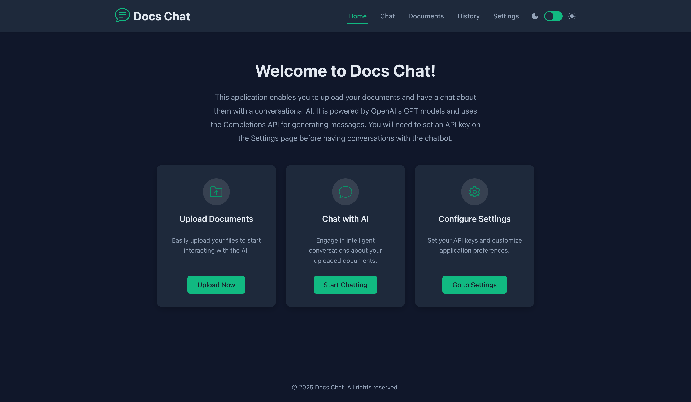

* chat before uploading documents
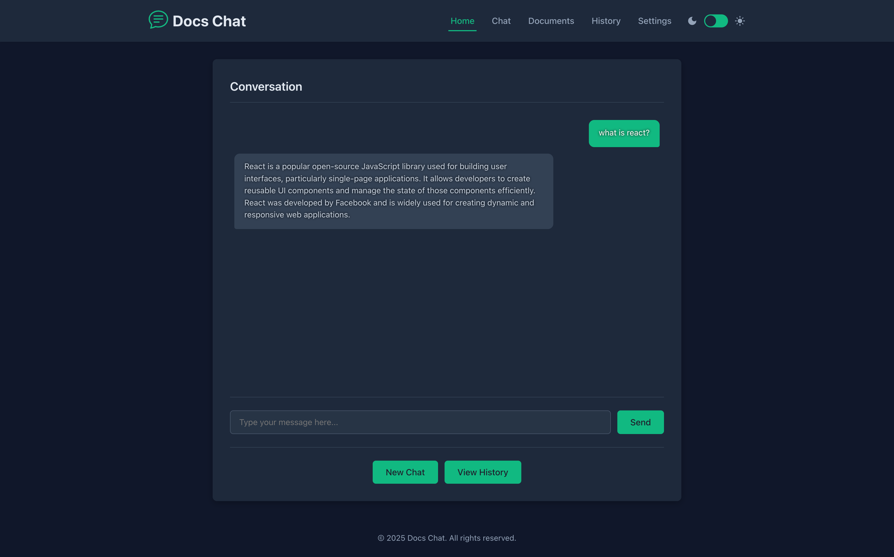

* chat after uploading a document (a pdf of the [ReAct prompting paper](https://arxiv.org/abs/2210.03629))
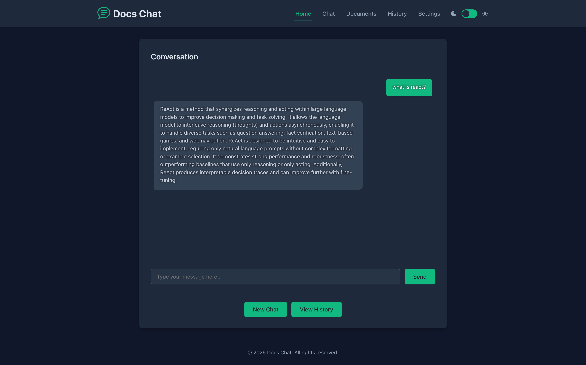

* document upload
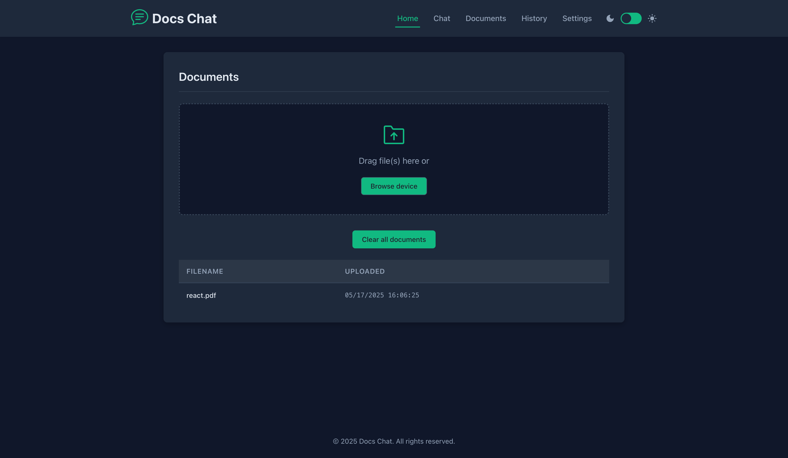

* chat history
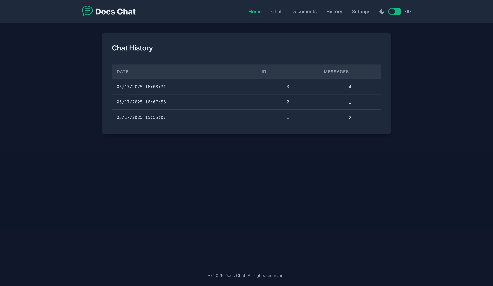

* individual chat history
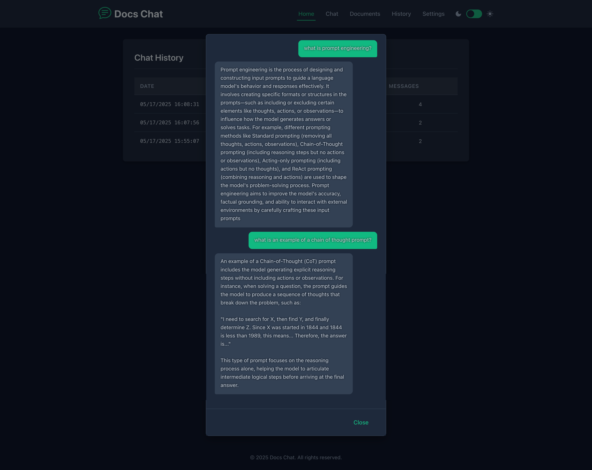

* settings
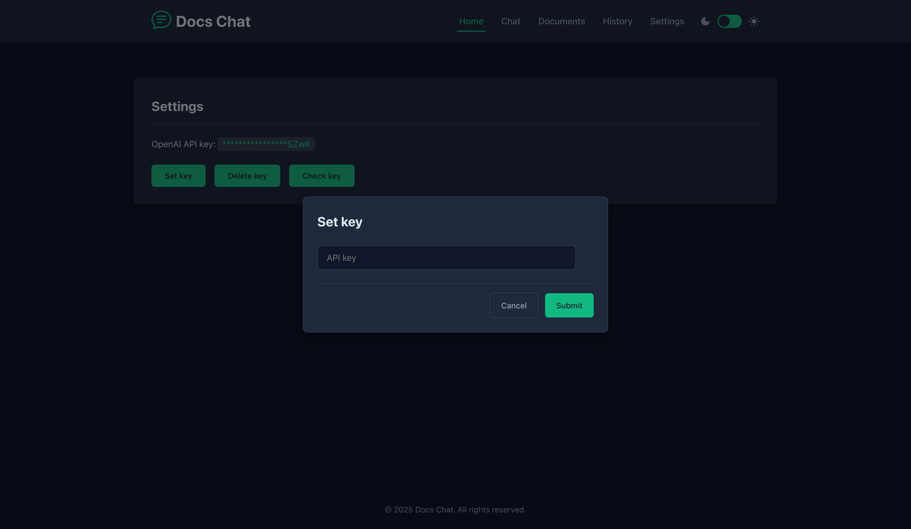

* light theme

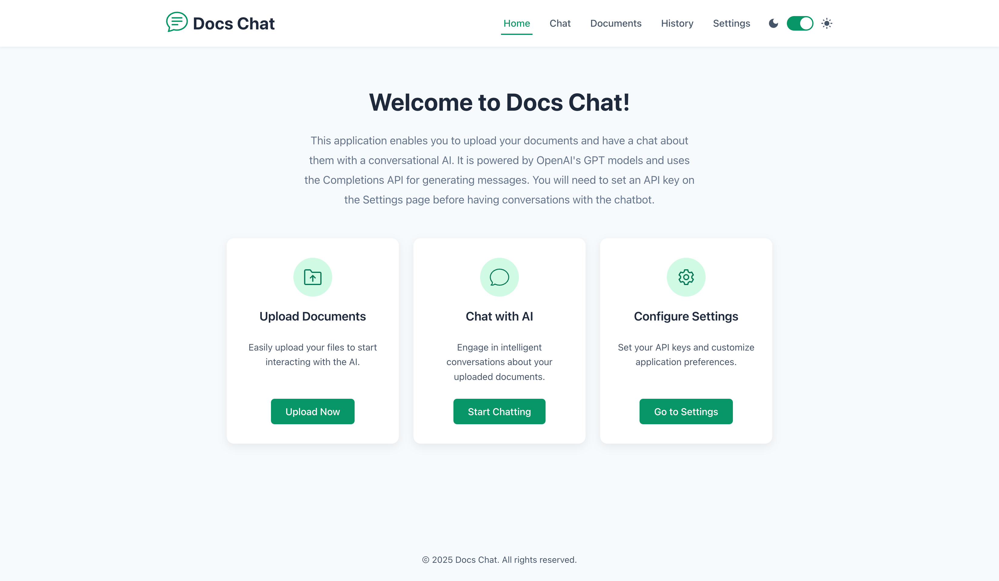
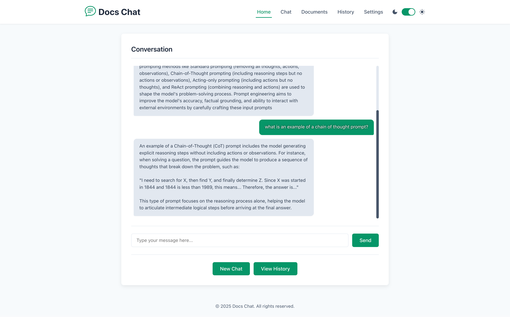
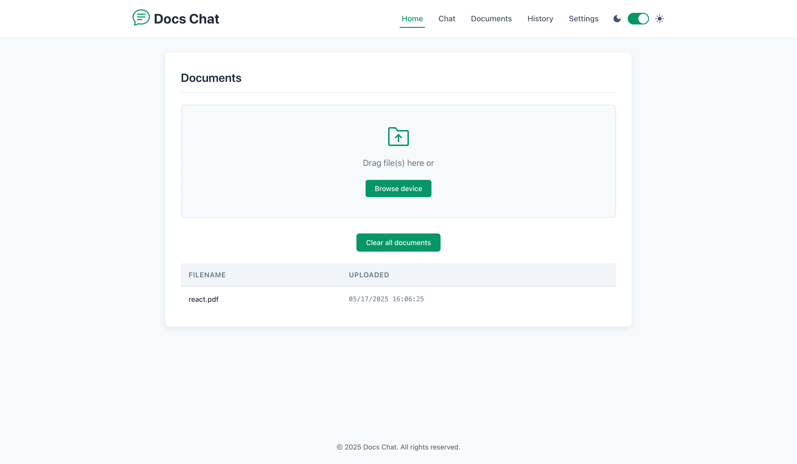
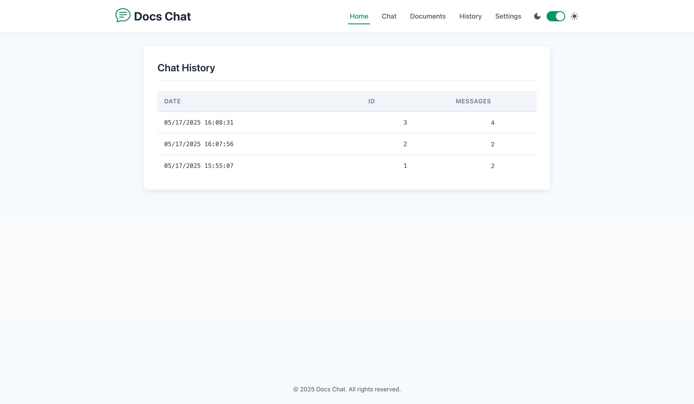
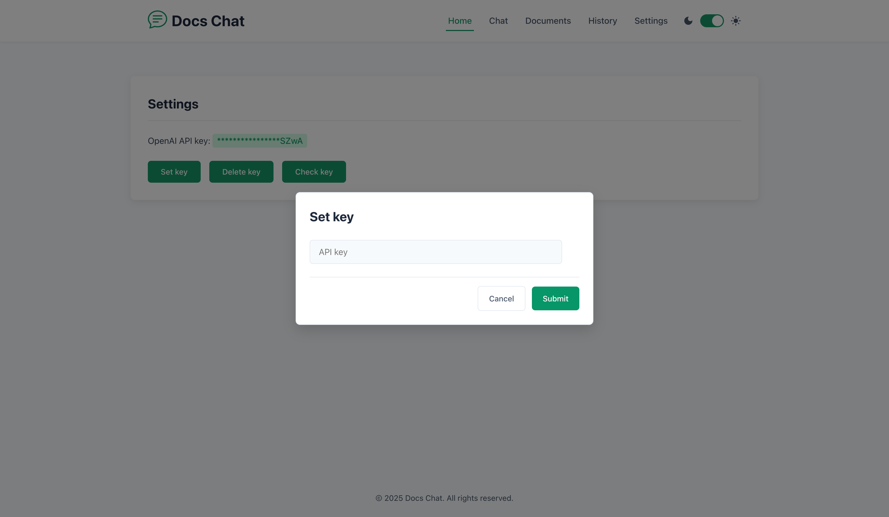
